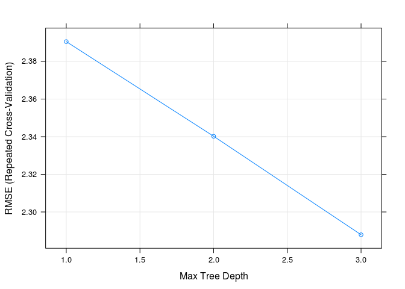

Homework 4: Bags, Forests, Boosts, oh my
================
Xiao Li
2/28/2019

Problem 1
---------

Problem 7 from Chapter 8 in the text. To be specific, please use a sequence of `ntree` from 25 to 500 in steps of 25 and `mtry` from 3 to 9 for by 1.

Answer 1
--------

``` r
set.seed(100)
df <- tbl_df(Boston)
inTraining <- createDataPartition(df$medv, p = .75, list = F)
training <- df[inTraining, ]
testing  <- df[-inTraining, ]
```

``` r
mtry_i = 7
ntree_n = 20

output <- matrix(ncol = mtry_i, nrow = ntree_n)
rownames(output) <- seq(25, 500, 25)
colnames(output) <- seq(3,9,1)
```

``` r
ntree <- data.frame(ntree = (seq(25, 500, 25)))
mtry <- data.frame(mtry = seq(3,9,1))

for (i in 1:mtry_i) {
  for(n in 1:ntree_n){
      rf_boston <- randomForest(medv ~ .,
                            data = training,  # create loop to change ntree value
                            mtry = mtry$mtry[i],
                            ntree = ntree$ntree[n])
      
      test_preds <- predict(rf_boston, newdata = testing)
      boston_test_df <- testing %>%
        mutate(y_hat_rf = test_preds,
               sq_err_rf = (y_hat_rf - medv)^2)
      output[n,i] <- mean(boston_test_df$sq_err_rf)
  }
}

rf_plot <- data.frame(output)
rf_plot <- rf_plot %>%
  mutate(ntree = seq(25,500,25))
```

``` r
rf_long <- rf_plot %>%
  gather(mtry, value, X3:X9)


p <- ggplot(rf_long, aes(x = ntree, y = value, col = mtry))
p + geom_line() +
  labs(y = "Test Error") +
  scale_color_brewer(palette="Paired")
```


Problem 2
---------

Problem 8 from Chapter 8 in the text. Set your seed with 9823 and split into train/test using 50% of your data in each split. In addition to parts (a) - (e), do the following:

1.  Fit a gradient-boosted tree to the training data and report the estimated test MSE.
2.  Fit a multiple regression model to the training data and report the estimated test MSE
3.  Summarize your results.

#### Regression Tree

``` r
df_car <- tbl_df(Carseats)
```

``` r
set.seed(9823)
inTraining <- createDataPartition(df_car$Sales, p = .5, list = F)
training <- df_car[inTraining, ]
testing  <- df_car[-inTraining, ]
```

``` r
reg_tree <- rpart(Sales ~ ., training)

plot(as.party(reg_tree))
```


``` r
reg_tree
```

    ## n= 201 
    ## 
    ## node), split, n, deviance, yval
    ##       * denotes terminal node
    ## 
    ##   1) root 201 1493.069000  7.465721  
    ##     2) ShelveLoc=Bad,Medium 162  931.485600  6.822222  
    ##       4) ShelveLoc=Bad 49  240.271900  5.210204  
    ##         8) Price>=102.5 35  131.203300  4.605143  
    ##          16) CompPrice< 137.5 27   72.802630  4.083704  
    ##            32) Population< 171.5 10   28.860560  3.098000 *
    ##            33) Population>=171.5 17   28.510590  4.663529 *
    ##          17) CompPrice>=137.5 8   26.282600  6.365000 *
    ##         9) Price< 102.5 14   64.221490  6.722857 *
    ##       5) ShelveLoc=Medium 113  508.667600  7.521239  
    ##        10) Price>=105.5 73  240.235300  6.706301  
    ##          20) Advertising< 13.5 59  165.356400  6.336102  
    ##            40) CompPrice< 121.5 18   15.182090  5.420556 *
    ##            41) CompPrice>=121.5 41  128.462200  6.738049  
    ##              82) Price>=131.5 16   37.749340  5.633125 *
    ##              83) Price< 131.5 25   58.677620  7.445200  
    ##               166) Age>=68 7    6.099143  6.087143 *
    ##               167) Age< 68 18   34.647600  7.973333 *
    ##          21) Advertising>=13.5 14   32.717120  8.266429 *
    ##        11) Price< 105.5 40  131.473500  9.008500  
    ##          22) Age>=50.5 27   54.832160  8.222963 *
    ##          23) Age< 50.5 13   25.377200 10.640000 *
    ##     3) ShelveLoc=Good 39  215.849000 10.138720  
    ##       6) Price>=127.5 13   41.850310  8.493846 *
    ##       7) Price< 127.5 26  121.239500 10.961150  
    ##        14) Education>=11.5 17   57.686200 10.060000 *
    ##        15) Education< 11.5 9   23.671200 12.663330 *

Estimated Test MSE:

``` r
test_preds <- predict(reg_tree, newdata = testing)
test_df <- testing %>%
  mutate(y_hat = test_preds,
         sq_err = (y_hat - Sales)^2)
mean(test_df$sq_err)
```

    ## [1] 4.484515

``` r
set.seed(25)
fit_control <- trainControl(method = "repeatedcv",
                            number = 10, 
                            repeats = 10) # general settings for tree with caret package
cv_reg_tree <- train(Sales ~ ., 
                     data = training,
                     method = "rpart2", 
                     trControl = fit_control)
plot(cv_reg_tree)
```



``` r
cv_reg_tree
```

    ## CART 
    ## 
    ## 201 samples
    ##  10 predictor
    ## 
    ## No pre-processing
    ## Resampling: Cross-Validated (10 fold, repeated 10 times) 
    ## Summary of sample sizes: 181, 180, 181, 181, 181, 181, ... 
    ## Resampling results across tuning parameters:
    ## 
    ##   maxdepth  RMSE      Rsquared   MAE     
    ##   1         2.390513  0.2557979  2.004266
    ##   2         2.340209  0.2928411  1.915846
    ##   3         2.287894  0.3445624  1.853347
    ## 
    ## RMSE was used to select the optimal model using the smallest value.
    ## The final value used for the model was maxdepth = 3.

``` r
plot(as.party(cv_reg_tree$finalModel))
```

 Estimated Test MSE:

``` r
test_preds <- predict(cv_reg_tree, newdata = testing)
test_df <- testing %>%
  mutate(y_hat = test_preds,
         sq_err = (y_hat - Sales)^2)
mean(test_df$sq_err) # estimated test MSE
```

    ## [1] 4.933184

According to the plot shown above, pruning the tree for this regression tree won't improve the test error.

#### Bagging

``` r
set.seed(25)
bag_car <- randomForest(Sales ~ ., 
                        data = training, 
                        mtry = 11,
                        importance = T) 
```

    ## Warning in randomForest.default(m, y, ...): invalid mtry: reset to within
    ## valid range

``` r
bag_car
```

    ## 
    ## Call:
    ##  randomForest(formula = Sales ~ ., data = training, mtry = 11,      importance = T) 
    ##                Type of random forest: regression
    ##                      Number of trees: 500
    ## No. of variables tried at each split: 10
    ## 
    ##           Mean of squared residuals: 2.794366
    ##                     % Var explained: 62.38

``` r
varImpPlot(bag_car)  
```

 By reading the output of `varImpPlot`, we can tell that the most important predictors are `ShelveLoc` and `Price`.

Estimated Test MSE:

``` r
test_preds <- predict(bag_car, newdata = testing)
test_df <- testing %>%
  mutate(y_hat = test_preds,
         sq_err = (y_hat - Sales)^2)
mean(test_df$sq_err) # estimated test MSE
```

    ## [1] 3.017009

#### Random Forest

``` r
set.seed(25)

rf_car_cv <- train(Sales ~ ., 
                   data = training,
                   method = "rf",
                   ntree = 100, # set ntree = 100
                   importance = T, 
                   tuneGrid = data.frame(mtry = 1:11))
rf_car_cv
```

    ## Random Forest 
    ## 
    ## 201 samples
    ##  10 predictor
    ## 
    ## No pre-processing
    ## Resampling: Bootstrapped (25 reps) 
    ## Summary of sample sizes: 201, 201, 201, 201, 201, 201, ... 
    ## Resampling results across tuning parameters:
    ## 
    ##   mtry  RMSE      Rsquared   MAE     
    ##    1    2.287119  0.4758077  1.829147
    ##    2    2.030279  0.5697864  1.611073
    ##    3    1.926706  0.5970857  1.527451
    ##    4    1.857973  0.6124586  1.475236
    ##    5    1.813815  0.6174203  1.435259
    ##    6    1.799330  0.6125500  1.427892
    ##    7    1.800537  0.6042434  1.433390
    ##    8    1.794369  0.6025009  1.428454
    ##    9    1.799306  0.5966258  1.434201
    ##   10    1.806377  0.5890422  1.440831
    ##   11    1.805898  0.5888190  1.438597
    ## 
    ## RMSE was used to select the optimal model using the smallest value.
    ## The final value used for the model was mtry = 8.

``` r
plot(rf_car_cv)
```

 Estimated Test MSE:

``` r
test_preds <- predict(rf_car_cv, newdata = testing)
test_df <- testing %>%
  mutate(y_hat = test_preds,
         sq_err = (y_hat - Sales)^2)
mean(test_df$sq_err) # estimated test MSE
```

    ## [1] 2.979339

By comparing the RMSE of bagging and random forest applied on testing dataset, we can see that random forest performs better with smaller RMSE, which means that `8 predictors` is enough for building significant tree model.

``` r
varImpPlot(rf_car_cv$finalModel)
```

 According to the variable importance plot of the optimal random forest shown above, we can tell that `ShelveLocGood` and `Price` are the most importance predictors.

``` r
rf_car_cv$finalModel
```

    ## 
    ## Call:
    ##  randomForest(x = x, y = y, ntree = 100, mtry = param$mtry, importance = ..2) 
    ##                Type of random forest: regression
    ##                      Number of trees: 100
    ## No. of variables tried at each split: 8
    ## 
    ##           Mean of squared residuals: 2.891171
    ##                     % Var explained: 61.08

#### Gradient-Boosted Tree

``` r
set.seed(25)
grid <- expand.grid(interaction.depth = c(1, 3),  # this parameter tell the splits of trees we want
                    n.trees = seq(0, 2000, by = 100),
                    shrinkage = c(.01, 0.001), # common value to use
                    n.minobsinnode = 10) # min number of observs in the nodes
trainControl <- trainControl(method = "cv", number = 5)
gbm_car <- train(Sales ~ ., 
                    data = training, 
                    distribution = "gaussian", 
                    method = "gbm", # method for gradient boosting
                    trControl = trainControl, 
                    tuneGrid = grid,
                    verbose = FALSE)
```

    ## Warning in nominalTrainWorkflow(x = x, y = y, wts = weights, info =
    ## trainInfo, : There were missing values in resampled performance measures.

``` r
gbm_car
```

    ## Stochastic Gradient Boosting 
    ## 
    ## 201 samples
    ##  10 predictor
    ## 
    ## No pre-processing
    ## Resampling: Cross-Validated (5 fold) 
    ## Summary of sample sizes: 160, 161, 161, 161, 161 
    ## Resampling results across tuning parameters:
    ## 
    ##   shrinkage  interaction.depth  n.trees  RMSE      Rsquared   MAE     
    ##   0.001      1                     0     2.725832        NaN  2.200998
    ##   0.001      1                   100     2.677733  0.3135835  2.168355
    ##   0.001      1                   200     2.635284  0.3275708  2.140715
    ##   0.001      1                   300     2.597933  0.3377065  2.114631
    ##   0.001      1                   400     2.566421  0.3524792  2.090639
    ##   0.001      1                   500     2.535097  0.3668144  2.065967
    ##   0.001      1                   600     2.505233  0.3734401  2.042016
    ##   0.001      1                   700     2.478978  0.3855218  2.019420
    ##   0.001      1                   800     2.454215  0.3939466  1.998139
    ##   0.001      1                   900     2.430543  0.4026616  1.977829
    ##   0.001      1                  1000     2.408032  0.4119097  1.958806
    ##   0.001      1                  1100     2.387142  0.4201742  1.940473
    ##   0.001      1                  1200     2.366163  0.4314319  1.922926
    ##   0.001      1                  1300     2.347189  0.4386198  1.906259
    ##   0.001      1                  1400     2.328674  0.4461442  1.890062
    ##   0.001      1                  1500     2.311905  0.4526862  1.874922
    ##   0.001      1                  1600     2.294774  0.4605515  1.859822
    ##   0.001      1                  1700     2.277098  0.4685799  1.845109
    ##   0.001      1                  1800     2.259941  0.4757366  1.830798
    ##   0.001      1                  1900     2.244232  0.4845034  1.817510
    ##   0.001      1                  2000     2.228982  0.4916265  1.804662
    ##   0.001      3                     0     2.725832        NaN  2.200998
    ##   0.001      3                   100     2.638927  0.4609666  2.135830
    ##   0.001      3                   200     2.563994  0.4754418  2.081832
    ##   0.001      3                   300     2.495676  0.4891192  2.032485
    ##   0.001      3                   400     2.436815  0.5009222  1.987693
    ##   0.001      3                   500     2.382189  0.5161817  1.943936
    ##   0.001      3                   600     2.329600  0.5323900  1.901140
    ##   0.001      3                   700     2.280982  0.5453588  1.860726
    ##   0.001      3                   800     2.236218  0.5586644  1.822051
    ##   0.001      3                   900     2.192986  0.5712034  1.784462
    ##   0.001      3                  1000     2.156564  0.5803361  1.752922
    ##   0.001      3                  1100     2.118774  0.5904479  1.720421
    ##   0.001      3                  1200     2.083435  0.6002589  1.690819
    ##   0.001      3                  1300     2.047677  0.6104503  1.661014
    ##   0.001      3                  1400     2.015812  0.6194664  1.633547
    ##   0.001      3                  1500     1.984721  0.6278863  1.606417
    ##   0.001      3                  1600     1.955429  0.6363768  1.581967
    ##   0.001      3                  1700     1.927821  0.6441483  1.559370
    ##   0.001      3                  1800     1.901817  0.6510332  1.539062
    ##   0.001      3                  1900     1.877167  0.6569888  1.519899
    ##   0.001      3                  2000     1.853145  0.6628836  1.501149
    ##   0.010      1                     0     2.725832        NaN  2.200998
    ##   0.010      1                   100     2.414688  0.4138092  1.957406
    ##   0.010      1                   200     2.230515  0.4852647  1.802369
    ##   0.010      1                   300     2.090122  0.5505505  1.689288
    ##   0.010      1                   400     1.975995  0.5973167  1.592578
    ##   0.010      1                   500     1.873059  0.6402777  1.510679
    ##   0.010      1                   600     1.789401  0.6653771  1.442851
    ##   0.010      1                   700     1.713662  0.6897379  1.382906
    ##   0.010      1                   800     1.643373  0.7117698  1.327876
    ##   0.010      1                   900     1.581390  0.7284600  1.280387
    ##   0.010      1                  1000     1.534423  0.7386397  1.245730
    ##   0.010      1                  1100     1.496146  0.7456598  1.219858
    ##   0.010      1                  1200     1.464523  0.7504797  1.195765
    ##   0.010      1                  1300     1.440456  0.7547674  1.176965
    ##   0.010      1                  1400     1.415174  0.7593138  1.153554
    ##   0.010      1                  1500     1.397459  0.7618161  1.137772
    ##   0.010      1                  1600     1.381225  0.7647948  1.122823
    ##   0.010      1                  1700     1.370260  0.7662038  1.113008
    ##   0.010      1                  1800     1.361508  0.7675747  1.105717
    ##   0.010      1                  1900     1.356933  0.7673129  1.099927
    ##   0.010      1                  2000     1.349018  0.7689056  1.091821
    ##   0.010      3                     0     2.725832        NaN  2.200998
    ##   0.010      3                   100     2.162974  0.5794624  1.759321
    ##   0.010      3                   200     1.850449  0.6645488  1.496756
    ##   0.010      3                   300     1.668366  0.7040548  1.355967
    ##   0.010      3                   400     1.557815  0.7243021  1.263450
    ##   0.010      3                   500     1.482268  0.7388799  1.202086
    ##   0.010      3                   600     1.435424  0.7471766  1.164416
    ##   0.010      3                   700     1.404835  0.7529005  1.133290
    ##   0.010      3                   800     1.386477  0.7556649  1.112602
    ##   0.010      3                   900     1.372464  0.7587011  1.102408
    ##   0.010      3                  1000     1.362157  0.7605981  1.094362
    ##   0.010      3                  1100     1.358014  0.7612393  1.088671
    ##   0.010      3                  1200     1.354595  0.7618543  1.086567
    ##   0.010      3                  1300     1.349602  0.7630462  1.081890
    ##   0.010      3                  1400     1.346644  0.7640456  1.080391
    ##   0.010      3                  1500     1.344932  0.7640172  1.081143
    ##   0.010      3                  1600     1.345576  0.7630003  1.080714
    ##   0.010      3                  1700     1.345670  0.7627168  1.080129
    ##   0.010      3                  1800     1.346367  0.7622819  1.082177
    ##   0.010      3                  1900     1.346011  0.7623762  1.083169
    ##   0.010      3                  2000     1.344432  0.7627070  1.081361
    ## 
    ## Tuning parameter 'n.minobsinnode' was held constant at a value of 10
    ## RMSE was used to select the optimal model using the smallest value.
    ## The final values used for the model were n.trees = 2000,
    ##  interaction.depth = 3, shrinkage = 0.01 and n.minobsinnode = 10.

``` r
plot(gbm_car)
```

 Estimated Test MSE:

``` r
test_preds <- predict(gbm_car, newdata = testing)
test_df <- test_df %>%
  mutate(y_hat_gbm = test_preds,
         sq_err_gbm = (y_hat_gbm - Sales)^2)
mean(test_df$sq_err_gbm) # estimated test MSE
```

    ## [1] 1.813391

#### Multiple Regression

``` r
mul_reg_car <- lm(Sales ~ ., training)
mul_reg_car
```

    ## 
    ## Call:
    ## lm(formula = Sales ~ ., data = training)
    ## 
    ## Coefficients:
    ##     (Intercept)        CompPrice           Income      Advertising  
    ##       5.3719058        0.0961630        0.0145521        0.1108655  
    ##      Population            Price    ShelveLocGood  ShelveLocMedium  
    ##       0.0002349       -0.0963392        4.8395901        1.9517284  
    ##             Age        Education         UrbanYes            USYes  
    ##      -0.0450811       -0.0198464        0.1770836       -0.2112815

Estimated Test MSE:

``` r
test_preds <- predict(mul_reg_car, newdata = testing)
test_df <- testing %>%
  mutate(y_hat_mul_reg = test_preds,
         sq_err_mul_reg = (y_hat_mul_reg - Sales)^2)
mean(test_df$sq_err_mul_reg)
```

    ## [1] 1.012709
